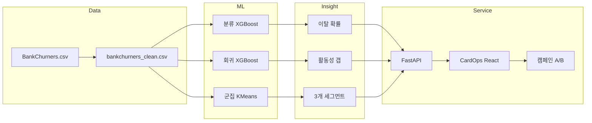

# CardOps — 신용카드 고객 이탈 예측 & 유지 전략

> **SKN34-2nd-4Team** · Kaggle Credit Card Customers  
> 분류 · 회귀 · 군집을 결합한 **의사결정 지원** 프로젝트

---

## 1. 한 문장 요약

**“누가 이탈할지(분류) + 정상 활동 대비 얼마나 줄었는지(회귀·갭) + 어떤 유형인지(군집)”를 합쳐, 케어 우선순위와 캠페인 전략을 제안한다.**

---

## 2. 문제 정의


| 항목             | 내용                                                                          |
| -------------- | --------------------------------------------------------------------------- |
| **배경**         | 신용카드사 고객 이탈률 **16.1%** — 클래스 불균형                                            |
| **Pain Point** | 이탈 **후** 대응은 늦음. “위험한데 **왜**, **어떤 유형**인지” 모르면 같은 캠페인을 전 고객에게 보냄            |
| **목표**         | ① 이탈 **확률** 예측 ② **거래 활동 갭** 조기 감지 ③ **행동 유형** 세그먼트 ④ **CardOps** 웹으로 운영 연계 |


---


## 3. 데이터


|         |                                                                                                      |
| ------- | ---------------------------------------------------------------------------------------------------- |
| **출처**  | [Kaggle — Credit Card Customers](https://www.kaggle.com/datasets/sakshigoyal7/credit-card-customers) |
| **원본**  | 10,127명 · 23열 (`BankChurners.csv`)                                                                   |
| **정제본** | 10,127명 · 20열 (`bankchurners_clean.csv`)                                                             |
| **타깃**  | `Target` — 유지(0) 83.9% / 이탈(1) **16.1%**                                                             |
| **제외**  | `CLIENTNUM`, 기존 NB 분류기 출력 2열 (데이터 누수 방지)                                                             |


---


## 4. 분석 파이프라인

```text
01 데이터 정제 → 02 EDA → 03 분류 → 04 회귀 → 05 군집
                                              ↓
                         src/*.py → outputs/models → Backend 배치 → CardOps UI
```


| 단계     | 노트북                                     | 핵심 질문               |
| ------ | --------------------------------------- | ------------------- |
| 정제     | `01_data_load_clean`                    | 라벨·결측·누수 변수 처리      |
| EDA    | `02_eda`                                | 이탈률, 변수별 차이, 상관관계   |
| **분류** | `03_classification`                     | **이 고객, 이탈할까?**     |
| **회귀** | `04_regression` / `04_regression_final` | **프로필상 얼마나 써야 정상?** |
| **군집** | `05_clustering` → `05_2clustering(gap)` | **어떤 유형인가?**        |


---


## 5. 모델 결과 요약


### 5-1. 분류 — 이탈 예측


| 모델                  | Test ROC-AUC | Test F1   | Test Recall | Test Precision |
| ------------------- | ------------ | --------- | ----------- | -------------- |
| Logistic Regression | —            | —         | —           | —              |
| Random Forest       | —            | —         | —           | —              |
| **XGBoost (최종)**    | **0.991**    | **0.903** | **0.883**   | **0.923**      |


- **Train/Test** 8:2, **Stratify**로 이탈 비율 유지
- 불균형 데이터 → **Accuracy 대신 Recall·F1·ROC-AUC** 중심 평가
- **Recall 88%** — 실제 이탈자 대부분 포착

> 발표 포인트: “이탈 **확률**로 **누구부터** 볼지” 정렬

---


### 5-2. 회귀 — 거래건수 예측 & 활동성 갭


| 항목                | 값                        |
| ----------------- | ------------------------ |
| **타깃**            | `Total_Trans_Ct` (거래건수)  |
| **최종 모델**         | XGBoost (Optuna/Grid 튜닝) |
| **Validation R²** | ≈ **0.865**              |
| **Test R²**       | ≈ **0.856**              |


**갭(Gap) 정의**

```text
예상_대비_거래_차이 = 실제 거래건수 − 예측 거래건수
```


| 갭      | 의미                             |
| ------ | ------------------------------ |
| **음수** | 예상보다 **덜** 씀 → 활동 **급감** 조기 신호 |
| **양수** | 예상보다 **더** 씀 → **우량** 신호       |


> 발표 포인트: 회귀는 “미래 LTV”가 아니라 **정상 대비 활동 이탈** 지표

---


### 5-3. 군집 — 고객 유형 (2단계 진화)


| 파일                         | 역할                                             | 발표에서의 위치        |
| -------------------------- | ---------------------------------------------- | --------------- |
| `05_clustering.ipynb`      | **베이스라인** — 행동 변수 5개로 K-Means                  | “1차 탐색 / 문제 정의” |
| `05_clustering_수빈.ipynb`   | 위와 동일 흐름 (팀원 작업본)                              | 백업·질문 대비용       |
| `05_1clustering.ipynb`     | **갭 기반 v1** — Test만, KMeans만, Silhouette ≥ 0.4 | “개선 아이디어”       |
| `05_2clustering.ipynb`     | **갭 기반 v2** — Train/Val/Test, KMeans·GMM 비교    | “모델 검증·선정”      |
| `05_clustering(gap).ipynb` | **갭 기반 파이프라인** — 회귀 결과 pickle 재사용, 전체 고객       | “운영·배치 연계”      |


#### ① 베이스라인 (`05_clustering`)

- 행동 변수 5개 + K-Means, **Target 미사용**
- k=3, Silhouette ≈ **0.22**


| 군집  | 유형        | 이탈     | 전략   |
| --- | --------- | ------ | ---- |
| 0   | 동면 위험     | **최고** | 재활성화 |
| 1   | 한도 락인·다상품 | 낮음     | 크로스셀 |
| 2   | 우량 활성     | **최저** | VIP  |


**한계:** “원래 저활동” vs “갑자기 줄어든” 고객 구분 어려움

#### ② 갭 기반 (`05_2clustering`) — **최종**

- 피처: `예상_대비_거래_차이` + `실제_거래건수`
- **KMeans k=3**, Silhouette **0.407** (목표 ≥0.4)
- KMeans vs GMM 비교 후 선정


| 비즈니스 라벨         | 평균 갭     | 해지율 | 캠페인                  |
| --------------- | -------- | --- | -------------------- |
| **우선케어(거래 감소)** | **−8.1** | 11% | **1순위** — 아직 이탈 전 급감 |
| **일반관리(유지)**    | −1.3     | 35% | 만성 저활동               |
| **우량(예상 이상)**   | **+7.6** | 4%  | VIP·유지               |


> 라벨 기준: **해지율 순 X** → **갭(활동 변화) 순 O**

---


## 6. 세 분석 결합 — 의사결정 매트릭스


| 이탈 확률 (분류) | 군집 (갭)   | 액션                   |
| ---------- | -------- | -------------------- |
| **높음**     | 우선케어     | 즉시 리텐션 콜·혜택          |
| **높음**     | 일반관리     | 재활성화 (저활동)           |
| **낮음**     | **우선케어** | **조기 경보** — 이탈 전 1순위 |
| **낮음**     | 우량       | VIP 업셀               |


```text
분류  → WHO  (누가 위험한가)
회귀  → GAP  (정상 대비 얼마나 벗어났는가)
군집  → TYPE (어떤 유형인가)
```

---


## 7. 서비스화 — CardOps

분석 결과를 **운영 도구**로 연결

```text
┌─────────────┐     ┌──────────────┐     ┌─────────────┐
│  React UI   │────▶│ FastAPI      │────▶│  MySQL 8.4  │
│  (CardOps)  │     │  + ML 모델   │     │  고객·인사이트│
└─────────────┘     └──────────────┘     └─────────────┘
       │                    │
       │                    └── outputs/models (XGB 등)
       └── 역할별 화면: 분석·운영·마케팅·관리자
```


| 구성                 | 역할                               |
| ------------------ | -------------------------------- |
| `src/*.py`         | 분류·회귀·군집 학습 → `outputs/models/`  |
| **Backend**        | 예측 API, 고객 인사이트, 캠페인·A/B 성과      |
| **Frontend**       | 로그인, 대시보드, 고위험 고객, 캠페인 관리        |
| **Streamlit**      | 모델 성능 대시보드 (학습·검증 시각화)           |
| **Docker Compose** | MySQL + Backend + Frontend 일괄 실행 |


### 주요 기능

- 고객별 **이탈 확률·군집·갭** 조회 (`customer_insights`)
- **고위험 고객** 필터·CSV 내보내기
- **캠페인** 대상 등록 · A/B 대조군 · **ROI·전환율** 집계
- 역할 기반 접근: Admin / Analyst / Operations / Marketing


### 접속 (로컬)


| 서비스        | URL                                                      |
| ---------- | -------------------------------------------------------- |
| CardOps UI | [http://127.0.0.1:5173](http://127.0.0.1:5173)           |
| API Docs   | [http://127.0.0.1:8000/docs](http://127.0.0.1:8000/docs) |


---


## 8. 아키텍처 한 장




---


## 9. 발표 스크립트 (약 10분)


| #   | 시간  | 내용                                                   |
| --- | --- | ---------------------------------------------------- |
| 1   | 1분  | **문제** — 이탈 16%, 사후 대응 한계, “누구·왜·어떤 유형” 필요           |
| 2   | 1분  | **데이터** — 1만 명, 불균형, 누수 변수 제거                        |
| 3   | 2분  | **분류** — XGBoost ROC-AUC 0.99, Recall 88% → 위험 고객 선별 |
| 4   | 2분  | **회귀·갭** — 정상 거래 예측, 실제−예측 = **조기 경보**               |
| 5   | 2분  | **군집** — 베이스라인(0.22) → 갭 기반(0.41), **우선케어·일반·우량**    |
| 6   | 1분  | **결합** — 분류+갭+군집 매트릭스 → 캠페인 우선순위                     |
| 7   | 1분  | **CardOps** — 분석을 UI·캠페인·A/B로 연결, 데모                 |


**클로징 한 줄**

> “ML 3종을 **하나의 운영 화면**으로 묶어, **같은 캠페인이 아닌 맞춤 유지**를 목표로 했습니다.”

---


## 10. 기대 효과


| Before      | After             |
| ----------- | ----------------- |
| 이탈 후 대응     | **갭 기반 조기 케어**    |
| 전 고객 동일 캠페인 | **세그먼트별** 전략      |
| 모델 = 노트북    | **CardOps** 배치·UI |
| 성과 감        | **A/B·ROI** 구조화   |


---


## 11. 한계 & 주의

- 공개·**단면** 데이터 — 실제 운영 성능으로 **직접 일반화 불가**
- 시간 순서 없음 — **시계열 이탈 예측**은 아님
- 회귀 R² ≈ 0.86 — 개인별 오차 존재, **갭은 경향·신호**로 해석
- Demo 캠페인 데이터는 **시연용** — 실제 비즈니스 판단 X

---


## 12. Q&A 예상

**Q. 왜 Accuracy 안 쓰나?**  
→ 이탈 16% — 전원 “유지”만 예측해도 84% 정확. **Recall·F1**이 맞음.

**Q. 군집에 Target 안 넣는 이유?**  
→ “이탈/비이탈” 2그룹만 나옴. **행동 유형** 발견이 목적.

**Q. 우선케어인데 해지율이 일반관리보다 낮은 이유?**  
→ 라벨 = **거래 급감** 기준. 해지율은 **사후 검증**.

**Q. CardOps와 Streamlit 차이?**  
→ Streamlit = **모델 성능** 확인 / CardOps = **고객·캠페인 운영**.

---


## 13. 저장소 & 실행

```text
SKN34-2nd-4Team/
├── notebooks/          # 분석 노트북 (01~05)
├── src/                # 재현 가능 Python 파이프라인
├── backend/            # FastAPI
├── frontend/           # React CardOps
├── dashboard/          # Streamlit
├── data/processed/     # 정제 데이터
└── outputs/models/     # 학습 모델 (gitignore)
```

```bash
# 모델 학습
python src/classification.py
python src/regression.py
python src/clustering.py

# Docker 전체 실행
docker compose up -d --build
docker compose exec backend python -m backend.scripts.import_customers
docker compose exec backend python -m backend.scripts.run_analysis_batch
```

---


## 14. 상세 문서


| 문서                                                                             | 내용                |
| ------------------------------------------------------------------------------ | ----------------- |
| `[README.md](README.md)`                                                       | 프로젝트 전체 가이드       |
| `[notebooks/README_05_clustering_발표.md](notebooks/README_05_clustering_발표.md)` | 군집 파트 상세          |
| `[군집readme.md](군집readme.md)`                                                   | 군집 프로파일·비즈니스 라벨   |
| `[docs/README.md](docs/README.md)`                                             | Docker·CardOps 환경 |
| `[docs/campaign_performance.md](docs/campaign_performance.md)`                 | 캠페인 A/B·ROI       |


---


## 15. 팀 역할 (로드맵 기준)


| 역할      | 업무                     |
| ------- | ---------------------- |
| 데이터/EDA | 정제, EDA, 데이터 사전        |
| 분류      | LR / RF / XGBoost      |
| 회귀·군집   | 갭, K-Means, GMM        |
| 해석/평가   | Lift/Gain, SHAP        |
| 서비스화    | CardOps, Streamlit, 발표 |


---

*SKN34-2nd-4Team · CardOps · 2026*