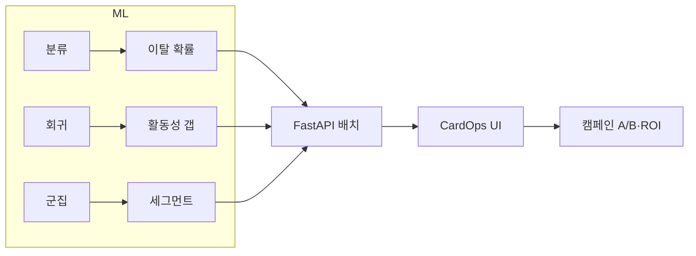

# CardOps — 통합 발표자료 (Frontend 데모용)

> **SKN34-2nd-4Team** · 신용카드 고객 이탈 예측 & 통합 운영 플랫폼  
> **발표 시 브라우저** [`http://127.0.0.1:5173`](http://127.0.0.1:5173) **를 열고 이 문서와 함께 진행하세요.**

---

## 한 문장 요약

**ML로 “누가·왜·어떤 유형으로” 이탈 위험인지 분석하고, CardOps 웹에서 역할별로 캠페인까지 실행·성과 측정하는 End-to-End 서비스입니다.**

---

# PART 1. 배경 & 분석 (2~3분, 화면 전에 말할 것)

## 1. 문제 정의

| 항목 | 내용 |
|------|------|
| **배경** | 신용카드 고객 이탈률 **16.1%** — 클래스 불균형 |
| **Pain Point** | 이탈 **후** 대응은 늦음. “위험한데 **왜**, **어떤 유형**인지” 모르면 전 고객 동일 캠페인 |
| **목표** | ① 이탈 **확률** ② **활동 갭** 조기 감지 ③ **행동 세그먼트** ④ **CardOps** 운영 연계 |

## 2. 데이터

| | |
|---|---|
| **출처** | [Kaggle — Credit Card Customers](https://www.kaggle.com/datasets/sakshigoyal7/credit-card-customers) |
| **규모** | 10,127명 · 정제 20열 |
| **타깃** | `Target` — 유지 83.9% / 이탈 **16.1%** |
| **제외** | `CLIENTNUM`, 기존 NB 분류기 출력 2열 (누수 방지) |

## 3. 분석 파이프라인

```text
01 정제 → 02 EDA → 03 분류 → 04 회귀 → 05 군집
                              ↓
         src/*.py → outputs/models → Backend 배치 → CardOps UI
```

## 4. 노트북 파일 맵 — 발표에서 어떤 파일을 말할지

| 구분 | 노트북 | 발표에서의 역할 |
|------|--------|-----------------|
| **분류** | `03_classification.ipynb` | **메인** — 3모델 비교, XGBoost, Lift/Gain |
| | `03_classification_수빈.ipynb` | **확장** — 5모델, 6:2:2 분할, LightGBM |
| **회귀** | `04_regression.ipynb` | **초안** — FE·튜닝·Voting, 갭 도입 |
| | `04_regression_final.ipynb` | **최종** — Val 기준 선정, **모델 A vs B** |
| | `04_regression_final(ex).ipynb` | **완성본** — 동일 논리 + Ablation 시각화 |
| **군집** | `05_clustering.ipynb` | **베이스라인** — 행동 5변수 K-Means |
| | `05_clustering_수빈.ipynb` | 베이스라인 팀원본 |
| | `05_1clustering.ipynb` | **갭 v1** — Test만, KMeans |
| | `05_2clustering.ipynb` | **갭 v2** — KMeans vs GMM, **발표 메인** |
| | `05_clustering(gap).ipynb` | **운영** — pickle 재사용, 전체 고객, GMM |

> **CardOps / `src/*.py` 배치**는 분류(XGB)·회귀(**모델 B**)·군집(갭 k=3) 기준

---

## 5. 분류 (`03_classification*.ipynb`)

### 공통

- **타깃:** `Target` (이탈 0/1)
- **전처리:** 범주형 One-Hot → 32피처
- **평가:** Accuracy ❌ → **Recall · F1 · ROC-AUC · Lift/Gain**
- **비즈니스:** 이탈 확률 상위 K% 타겟팅 → **CardOps `churn_probability`**

### `03_classification.ipynb` — **팀 메인**

| 항목 | 내용 |
|------|------|
| **분할** | Train 80% / Test 20% (Stratify) |
| **모델** | Logistic Regression · Random Forest · **XGBoost** (기본 파라미터) |
| **최종** | **XGBoost** |

| 모델 | Test F1 | Test ROC-AUC | Test Recall | Test Precision |
|------|:---:|:---:|:---:|:---:|
| Logistic Regression | 0.644 | 0.921 | — | — |
| Random Forest | 0.859 | 0.985 | — | — |
| **XGBoost** | **0.903** | **0.991** | **0.883** | **0.923** |

**발표 멘트:**
- Recall **88%** — 실제 이탈자 대부분 포착
- **Gain Chart** — 상위 20%만 보면 무작위 대비 이탈자 **몇 배** 집중
- **화면 연결:** `예상 이탈 확률`, `위험도(high/medium/low)`, HIGH 필터 카드

### `03_classification_수빈.ipynb` — **확장 실험**

| 항목 | 내용 |
|------|------|
| **분할** | Train 60% / Val 20% / Test 20% |
| **모델** | LR · RF · XGBoost · **LightGBM** · MLP (+ DT) |
| **최종** | **LightGBM** (Test F1 **0.901**, AUC **0.994**) |

| 모델 | Test F1 | Test AUC |
|------|:---:|:---:|
| XGBoost | 0.897 | 0.993 |
| **LightGBM** | **0.901** | **0.994** |

> 발표: “수빈 노트북에서 LightGBM까지 비교했지만, **서비스·메인 노트북은 XGBoost**로 통일”

---

## 6. 회귀 (`04_regression*.ipynb`)

### 공통

- **타깃:** `Total_Trans_Ct` (거래건수)
- **분할:** Train 60% / Val 20% / Test 20%
- **파이프라인:** 베이스라인 → 피처 엔지니어링 → 튜닝(수동/Random/Grid/Optuna) → Voting/Stacking
- **갭:** `활동성_갭 = 실제 거래건수 − 예측 거래건수` → **CardOps `activity_gap`**

### `04_regression.ipynb` — 초안

| 항목 | 내용 |
|------|------|
| **최종** | Voting (Val R² **0.8666**, Test R² **0.8578**) |
| **주의** | Test R² 최고 모델을 골라 **데이터 누수** 가능 → final에서 수정 |
| **기여** | 갭 정의 · 조기경보 Top15 · 비즈니스 적용 최초 |

### `04_regression_final.ipynb` / `(ex).ipynb` — **최종 (발표 핵심)**

#### 6-1. 모델 선정 (R² 예측용)

| 항목 | 값 |
|------|-----|
| **선정 기준** | **Validation R²** (Test는 1회만 참고) |
| **최종 방법** | **Voting** (XGB+RF+GBM+LGBM) |
| Val R² | **0.8666** |
| Test R² | **0.8578** |

#### 6-2. 모델 A vs B — **“R² 높다 ≠ 목적에 맞다”**

| | **A. 금액 포함** | **B. 금액 제외 (조기경보)** |
|---|---|---|
| **목적** | 거래건수 **맞추기** | **이탈 조기경보** |
| Test R² | **0.858** | **0.304** |
| Test MAE | 6.95 | 15.22 |
| **갭-이탈 상관** | −0.178 | **−0.290** |
| **갭 AUC** | 0.629 | **0.732** |
| **하위20% 포착률** | 30.9% | **43.7%** |

**발표 멘트 (꼭):**
> A는 `Total_Trans_Amt`와 **동어반복**이라 R²만 높음.  
> **B는 R²는 낮지만 갭이 이탈을 더 잘 구분** → 군집·캠페인·UI는 **모델 B**.

#### 6-3. Ablation (final 노트북)

- B baseline R² ≈ **0.28~0.30** — **데이터 정보 한계** (금액 없으면 예측 어려움)
- `avg_ticket = Amt/Ct` 넣으면 R² **0.95** → **누수** 증명
- **결론:** 낮은 R²를 FE로 억지로 올리지 않고, **갭 AUC**로 평가

#### 6-4. 산출물

- `gap_result_B.pkl` 저장 → `05_clustering(gap).ipynb` · Backend 배치에서 재사용

---

## 7. 군집 (`05_*.ipynb`)

### 공통 원칙

- **Target(이탈)은 군집 입력에 사용하지 않음** → 사후 검증·라벨링만
- **최종 피처:** `예상_대비_거래_차이` + `실제_거래건수`
- **화면 연결:** `cluster_name`, `cluster_confidence`, `recommended_action`

### ① 베이스라인 — `05_clustering.ipynb` / `05_clustering_수빈.ipynb`

| 항목 | 내용 |
|------|------|
| **피처** | 거래건수, 한도소진율, 리볼빙, 보유상품, 문의횟수 (5개) |
| **모델** | K-Means **k=3** |
| **Silhouette** | ≈ **0.218** |

| 군집 | 유형 | 이탈 | 전략 |
|------|------|------|------|
| 0 | **동면 위험** | 최고 | 재활성화 |
| 1 | 한도 락인·다상품 | 낮음 | 크로스셀 |
| 2 | **우량 활성** | 최저 | VIP |

**한계:** “원래 저활동” vs “갑자기 줄어든” 구분 어려움 → **갭 기반으로 전환**

### ② 갭 v1 — `05_1clustering.ipynb`

- 회귀 XGB로 Test 예측 → 갭 계산
- KMeans k=3, Silhouette **0.406**
- 라벨: **우선케어 / 저활동·고위험 / 우량**

### ③ 갭 v2 — `05_2clustering.ipynb` (**발표 메인**)

| 항목 | 내용 |
|------|------|
| **분할** | Train/Val/Test 6:2:2, 군집은 **Test** |
| **비교** | KMeans vs GMM (k=2~8) |
| **목표** | KMeans Silhouette ≥ **0.4**, GMM ≥ **0.3** |
| **최종** | **KMeans k=3**, Silhouette **0.407** |

| 비즈니스 라벨 | 고객수 | 평균 갭 | 해지율 |
|---------------|--------|---------|--------|
| **우선케어(거래 감소)** | 644 | **−8.1** | 11% |
| **일반관리(유지)** | 633 | −1.3 | 35% |
| **우량(예상 이상)** | 749 | **+7.6** | 4% |

> k=2가 Silhouette 더 높아도 **3단계 케어**(우선·일반·우량)가 운영에 유리

### ④ 운영 파이프라인 — `05_clustering(gap).ipynb`

| 항목 | 내용 |
|------|------|
| **입력** | `gap_result_B.pkl` (회귀 재학습 없음) |
| **대상** | **전체 10,127명** |
| **최종** | **GMM k=3 spherical**, Silhouette **0.476** |

| 라벨 | 고객수 | 평균 갭 | 해지율 |
|------|--------|---------|--------|
| 우선케어 | 3,268 | −20.9 | 37% |
| 일반관리 | 4,677 | +3.4 | 8% |
| 우량 | 2,182 | +24.2 | 2% |

---

## 8. 세 분석 결합 → CardOps 화면

```text
분류  → WHO  → 예상 이탈 확률 · 위험도(낮음/주의/높음)
회귀  → GAP  → 예상 거래건수 · 활동성 갭
군집  → TYPE → 고객 군집 · 군집 신뢰도 · 추천 액션
```

| 이탈 확률 | 군집 | 액션 |
|-----------|------|------|
| 높음 | 우선케어 | 즉시 리텐션 |
| 높음 | 일반관리 | 재활성화 |
| **낮음** | **우선케어** | **조기 경보 1순위** |
| 낮음 | 우량 | VIP 업셀 |

## 9. 시스템 구조

```text
[React CardOps :5173] ←→ [FastAPI :8000] ←→ [MySQL :3307]
                                  ↑
                           outputs/models/
```



---

# PART 2. Frontend 데모 (6~7분, 화면 보면서)

## 사전 준비

```bash
docker compose up -d --build
docker compose exec backend python -m backend.scripts.import_customers
docker compose exec backend python -m backend.scripts.run_analysis_batch
# (선택) docker compose exec backend python -m backend.scripts.seed_demo_campaign --limit-per-campaign 60
```

| 서비스 | URL |
|--------|-----|
| **CardOps UI** | http://127.0.0.1:5173 |
| API Docs | http://127.0.0.1:8000/docs |
| Ready 체크 | http://127.0.0.1:8000/ready |

## 역할 4종 — 로그인 계정

| 역할 | 계정 | 첫 화면 | 데모 순서 추천 |
|------|------|---------|----------------|
| **analyst** | `analyst` | 고객 분석 대시보드 | **①** |
| **marketing** | `marketing` | 캠페인 관리 센터 | **②** |
| **operations** | `operations` | 운영 업무 센터 | **③** |
| **admin** | `admin` | 관리자 콘솔 | (시간 있을 때) |

> `seed_test_users` 후 `.env`의 `TEST_*_PASSWORD` 사용

### 권한

| 기능 | analyst | operations | marketing | admin |
|------|:---:|:---:|:---:|:---:|
| 분석 조회 | ✅ | ✅ | ✅ | ✅ |
| 캠페인 대상 등록 | ❌ | ❌ | ✅ | ✅ |
| 캠페인 처리 | ❌ | ✅ | ❌ | ✅ |
| 일괄 타기팅 | ❌ | ❌ | ✅ | ✅ |
| 팀 역할 변경 | ❌ | ❌ | ❌ | ✅ |

---

## STEP 1. 로그인 (`LoginPage`)

**화면:** CardOps 로고 · 아이디/비밀번호 · 회원가입

**말할 것:**
- B2B 팀 계정 콘솔
- Argon2 + **HttpOnly 쿠키** (토큰 JS 미노출)
- 역할별 **다른 업무 화면** 분기

**▶ `analyst` 로그인**

---

## STEP 2. 고객 분석 대시보드 (`DashboardPage`) — analyst

**헤더:** 「고객 분석 대시보드」 — *이탈 위험과 실행 우선순위 확인*

### 벤토 카드 — 위에서 아래로 짚기

| 카드 | 화면 라벨 | ↔ ML | 멘트 |
|------|-----------|------|------|
| Hero | CUSTOMER HEALTH | 배치 결과 | 스코어링된 고객 수 |
| | CHURN PROBABILITY | **분류** | 평균 이탈 확률 |
| 클릭! | ACTION PRIORITY · HIGH | **분류** | **클릭 → high 필터** |
| | RISK MONITOR | **분류** | low/medium/high 분포 |
| | SEGMENTATION | **군집** | 우선케어·우량 등 |
| | DATA FRESHNESS · SYNCED | 배치 | 3모델 버전·시각 |
| | CUSTOMER INSIGHTS | 전체 | 테이블 |

### 고객 목록 — **데모 핵심**

1. **필터:** 위험도 · **군집** · 고객 ID · 정렬(이탈확률/갭)
2. **행 클릭** → 우측 **고객 상세 패널**
3. **CSV 다운로드**

### 고객 상세 패널 (`CustomerDetailPanel`)

| 화면 항목 | ML |
|-----------|-----|
| 예상 이탈 확률 · 위험 배지 | 분류 |
| **예상 거래건수 · 활동성 갭** | 회귀 |
| **고객 군집 · 군집 신뢰도** | 군집 |
| 추천 액션 · 추천 근거 | Rule |
| 분석 이력 | 배치 추이 |
| 캠페인 업무 | 마케팅/운영 연계 |

> **“한 화면에 분류·회귀·군집이 합쳐져, 왜 이 고객인지 바로 보입니다.”**

---

## STEP 3. 캠페인 관리 (`CampaignManagementPage`) — marketing

**▶ 로그아웃 → `marketing` 로그인** (마케팅은 캠페인 센터가 첫 화면)

| 패널 | 보여줄 것 |
|------|-----------|
| **캠페인 목록** | 생성 · draft/active/completed |
| **캠페인 후보 고객** | 중복·수신거부 제외 필터 |
| **일괄 타기팅** | 세그먼트 프리셋 |
| **성과 대시보드** | A/B · ROI |

### 일괄 타기팅 (`BulkTargetingPanel`) — ML 연결 강조

| 세그먼트 | 선정 기준 |
|----------|-----------|
| **고위험 리텐션** | risk = **high** |
| **중위험 재활성화** | risk = medium + **갭 하위 20%** |
| **우량 업셀링** | risk = low + **우량(예상이상) 군집** |

- A/B: **대조군 비율** 설정 → treatment/control 자동 배정
- **미리보기 → 실행** → 운영 WORK QUEUE 생성

> **“노트북의 군집·갭·이탈확률이 캠페인 타기팅 규칙입니다.”**

### 성과 (`CampaignPerformancePanel`)

- 대상군 vs **대조군** 전환율
- **증분 ROI** · 유지율

---

## STEP 4. 운영 업무 센터 (`DepartmentDashboardPage`) — operations

**▶ `operations` 로그인**

| 섹션 | 내용 |
|------|------|
| 통계 | HIGH RISK · OPEN QUEUE · 배치 |
| 우선 관리 고객 | high 위험 목록 |
| **WORK QUEUE** | pending → assigned → contacted → completed |

**데모 동작:**
1. 대기 대상 선택
2. **담당 배정 → 접촉 완료 → 처리 완료**
3. 결과 코드 · 전환 · 저장

> **“ML이 누구를 찾고, 운영이 실제 연락·결과를 남깁니다.”**

---

## STEP 5. 관리자 (`DepartmentDashboardPage`) — admin (선택)

- **활성 팀 계정** — 역할 변경
- **「분석 대시보드」** → 캠페인 피드백(전환·ROI) 포함 뷰

---

# PART 3. 발표 타임라인 (약 10분)

| # | 시간 | 내용 | 화면 |
|---|------|------|------|
| 1 | 1분 | 문제·데이터·불균형 | — |
| 2 | 2분 | 분류·회귀·군집 결과 | (선택) Streamlit |
| 3 | 1분 | 세 분석 결합 매트릭스 | — |
| 4 | 2분 | **analyst** 대시보드 · 고객 상세 | **5173** |
| 5 | 2분 | **marketing** 일괄 타기팅 · ROI | **5173** |
| 6 | 1분 | **operations** WORK QUEUE | **5173** |
| 7 | 1분 | 클로징 | — |

**클로징 한 줄**

> “ML 3종을 **하나의 운영 화면**으로 묶어, **맞춤 유지**를 목표로 했습니다.”

---

# PART 4. 기대 효과 · 한계 · Q&A

## Before → After

| Before | After |
|--------|-------|
| 이탈 후 대응 | **갭 기반 조기 케어** |
| 전 고객 동일 캠페인 | **세그먼트별** 전략 |
| 모델 = 노트북 | **CardOps** 배치·UI |
| 성과 감 | **A/B·ROI** |

## 한계

- 공개·단면 데이터 — 실운영 직접 일반화 ❌
- 시계열 예측 아님
- Demo 캠페인 = **시연용**

## Q&A

| 질문 | 답 |
|------|-----|
| Accuracy? | 이탈 16% → Recall·F1 |
| 군집에 Target? | 행동 **유형** 발견 목적 |
| 우선케어인데 해지율 낮음? | **거래 급감** 기준, 해지율은 사후 검증 |
| Streamlit vs CardOps? | Streamlit = **모델 성능** / CardOps = **운영** |
| 실시간? | 배치 + DB. 단건 API도 있음 |
| 역할 분리? | 마케팅(등록) / 운영(처리) |

---

# PART 5. 데모 체크리스트

- [ ] `docker compose ps` — mysql healthy, backend/frontend Up
- [ ] `/ready` — 모델 OK
- [ ] `run_analysis_batch` — 고객 수 > 0
- [ ] analyst: HIGH 클릭 → 고객 1명 상세(갭·군집)
- [ ] marketing: 일괄 타기팅 미리보기
- [ ] operations: WORK QUEUE 1건 처리
- [ ] (선택) ROI 패널

---

# PART 6. 화면 ↔ 파일 (질문 대비)

| 화면 | 파일 |
|------|------|
| 역할 분기 | `frontend/src/app/App.tsx` |
| 로그인 | `frontend/src/features/auth/LoginPage.tsx` |
| 분석 대시보드 | `frontend/src/features/dashboard/DashboardPage.tsx` |
| 운영/마케팅/관리자 | `frontend/src/features/department/DepartmentDashboardPage.tsx` |
| 캠페인 관리 | `frontend/src/features/campaign/CampaignManagementPage.tsx` |
| 일괄 타기팅 | `frontend/src/features/campaign/BulkTargetingPanel.tsx` |
| 캠페인 성과 | `frontend/src/features/campaign/CampaignPerformancePanel.tsx` |

---

# 발표 6줄 스크립트 (암기용)

1. **CardOps** — 카드 고객 이탈 ML + 캠페인 End-to-End  
2. **분류·회귀·군집** → 이탈 확률 · 활동 갭 · 고객 유형  
3. **analyst** 대시보드 — 고객별 통합 인사이트  
4. **marketing** — 세그먼트·일괄 타기팅·A/B·ROI  
5. **operations** — WORK QUEUE 실제 처리  
6. **노트북 → 배치 → 웹** 연결

---

*SKN34-2nd-4Team · CardOps · 2026*
